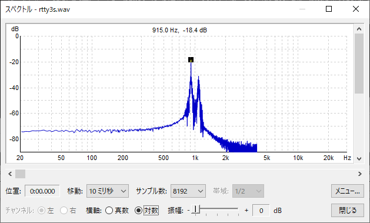
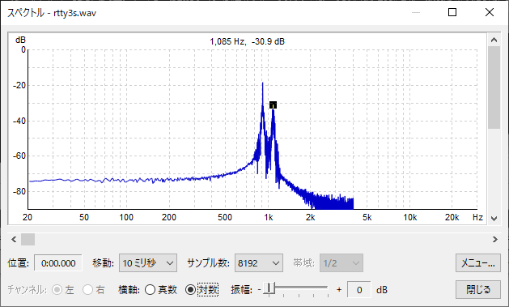
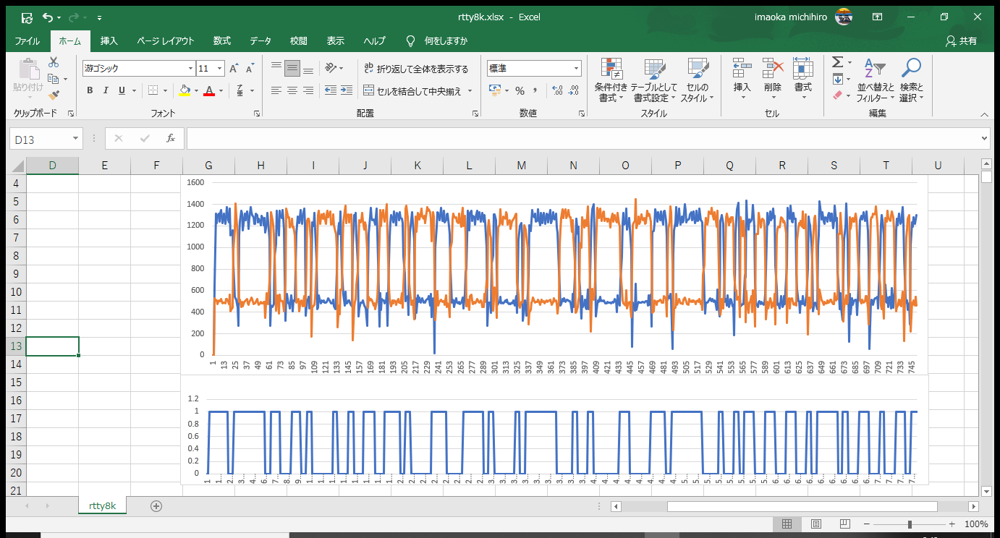

# Pythonによるラジオテレタイプの復調プログラム
This is a Python program to demodulate the radio teletype known as FSK modulation.
This is the simplest example, and only the Terminal Unit part of the RTTY is implemented. The rest should be coded according to ITA2, for example.

## ソースコード

~~~
import wave
import numpy as np
fname='rtty3s.wav' # should be specify the filename.
smp= 8000          # Sampling Rate
FQm= smp/914.0     # Mark Frequency 914Hz
FQs= smp/1086.0    # Space Frequency 1086Hz
wind= 32           # windows size Integer
waveFile = wave.open(fname, 'r')

mq=[];mi=[];sq=[];si=[]
for j in range(waveFile.getnframes()):
      buf = waveFile.readframes(1)
      mq.append((buf[0]-128)*np.sin(np.pi*2.0/FQm*j))
      mi.append((buf[0]-128)*np.cos(np.pi*2.0/FQm*j))
      sq.append((buf[0]-128)*np.sin(np.pi*2.0/FQs*j))
      si.append((buf[0]-128)*np.cos(np.pi*2.0/FQs*j))
      mk = np.sqrt(sum(mq)**2 + sum(mi)**2)
      sp = np.sqrt(sum(sq)**2 + sum(si)**2)     
      print(mk,sp,int(mk>sp),sep=",")
      if j>wind:
            mq.pop(0);mi.pop(0);sq.pop(0);si.pop(0)
waveFile.close()
~~~
## サンプル音声ファイル
should be convet to wave format.

https://en.wikipedia.org/wiki/File:RTTY.ogg 

it is from wikipedia

      
## パラメーター
Some parameters in the source code need to be modified according to the audio file to be input. 
~~~
fname='rtty3s.wav' # should be specify the filename.
smp= 8000          # Sampling Rate
FQm= smp/914.0     # Mark Frequency 914Hz
FQs= smp/1086.0    # Space Frequency 1086Hz
~~~
- fname   
should be specify the filename.
- smp   
Sampling Rate.
- FQm     
Mark Frequency. 
- FQs   
Space Frequency. 

## マークとスペースの周波数の設定方法
To find MARK & SPACE frequences, You can use any spectrum analyze tools on your PC. For example I use Sazanami Version 1.7.3 2020/10/22
. 

- MARK Frequency about 915Hz    

- SPACE Frequency is about 1085Hz   

## 使い方
Please specify an appropriate audio file for the input.
This program assumes 8KHz sampling, mono, 8bit quantization, and no sign.
~~~
python rtty8k.py > rtty.csv
~~~
Demodulation example

