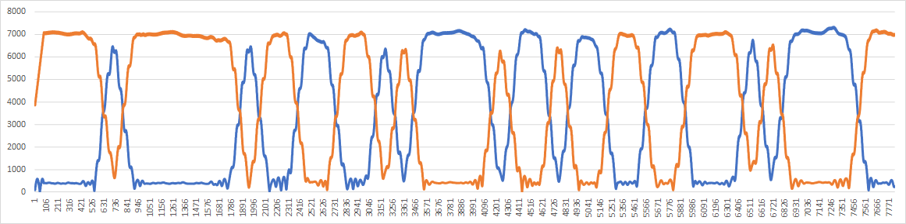

# Demodulation Radio Teletype (RTTY) in Python
This is a Python program to demodulate the radio teletype known as FSK modulation.
This is the simplest example, and only the Terminal Unit part of the RTTY is implemented. The rest should be coded according to ITA2, for example.

## Description of the source code

~~~
fname = 'rtty3s.wav' # should be specify the filename.
Smp = 8000 # Sampling Rate
FQm = Smp/914.0 # Mark Frequency 914Hz
FQs = Smp/1086.0 # Space Frequency 1086Hz
Baud = 176 # Smp/45.45 but shuold be Integer
~~~
## Usage
Please specify an appropriate audio file for the input.
This program assumes 8KHz sampling, mono, 8bit quantization, and no sign.
~~~
python rtty8k.py > rtty.csv
~~~
Demodulation example

